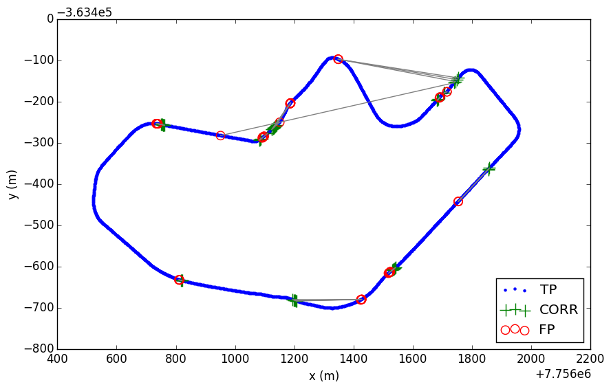
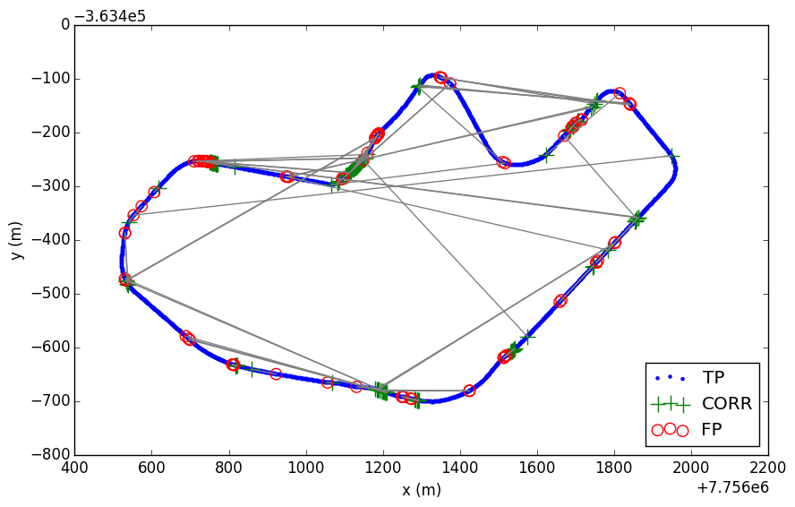

# ensemble_lcad
The ensemble_lcad repository contains implementations for ensembles of kNN classifiers using metrics such as Hamming distance alone and in conjunction with DTW.

## Introduction

It was proposed in [1] a new Sequential Appearance-Based approach to the Global Localization problem. It is based on an ensemble of kNN classifiers, where each classifier uses the Dynamic Time Warping (DTW) and the Hamming distance to compare binary features extracted from sequences of images. 

## Preparing datasets

In [1], it was collected two laps data in different dates for experimenting with. For each lap, a robotic car was driven with an average speed of 25 km/h around UFES campus. An entire lap around the university campus has an extension of about 3.57 km. During the laps, image and robot's pose data were acquired synchronously.

The first lap data was recorded on 3rd of October 2012 (UFES-2012) and comprises a sequence of 5,821 image-pose pairs, while the second lap data was recorded on 18th of April 2014 (UFES-2014) and comprises a sequence of 4,414 image-pose pairs. The difference in size between same spacing datasets is mainly due to frame rate difference between recordings. 

To evaluate the effect of learning an increasing number of images, the UFES-2012 dataset was sampled at five different intervals: 30m, 15m, 10m, 5m and 1m. After sampling the UFES-2012, five datasets were created: a 1-meter spacing dataset with a total of 2,536 image-pose pairs, a 5-meter dataset with a total of 646 image-pose pairs, a 10-meter dataset with 333 image-pose pairs, a 15-meter dataset with 225 image-pose pairs, and a 30-meter dataset with 114 image-pose pairs. The same was done with the UFES-2014 resulting in five datasets with a total of 2,283, 635, 331, 224 and 113 image-pose pairs. 

In average and without sampling, the distances between UFES-2012 and UFES-2014 corresponding image-pose pairs is 1.20m and standard deviation equals to 0.96. Conversely, the distances between UFES-2014 and UFES-2012 corresponding image-pose pairs is 1.38m and standard deviation equals to 1.04. 

All datasets mentioned above are available at [http://www.lcad.inf.ufes.br/log](http://www.lcad.inf.ufes.br/log). 

To validate the proposed system for the global localization problem, a set of experiments was run with the datasets mentioned above. The UFES-2012 datasets were used to train the system about the trajectory and the UFES-2014 datasets were used to test the accuracy of the system by estimating poses along the previous experienced trajectory. Conversely, the UFES-2014 datasets were used for training and the UFES-2012 datasets for test. The ground-truth was established using the Euclidean distance between pairs of image-pose from each lap.

## Additional experiments taking UFES-2014 for training and UFES-2012 for test

### Classification Accuracy

Figure 1 shows the classification accuracy results obtained using UFES-2014 datasets for training and UFES-2012 datasets for test. The vertical axis represents the percentage of estimated image-pose pairs that were within an established Maximum Allowed Error (MAE) in frames from the first image-pose pair of a given query subsequence. The MAE is equal to the amount of image-pose pairs that one has to go forward or backwards in the test dataset to find the corresponding query image. The horizontal axis represents the MAE in frames. Finally, the curves represent the results for different spacing datasets.

As the graph of Figure 1a shows, SABGL classification accuracy increases with MAE for all the spacing datasets and reaches a plateau at about 5 frames for all training datasets. However, for the 1-meter spacing training dataset, the SABGL classification uncertainty is large in the beginning of the curve due to the similarity between images in the near-by image-pose pairs. If one does not accept any system error (MAE equals zero), the accuracy is only about 28%. But, if one accepts an error of up to 5 frames (MAE equals 5), the accuracy increases to about 96%. On the other hand, when using a dataset with a larger spacing between image-pose pairs for training, the system accuracy increases more sharply. For example, when the system is trained with the 5-meter spacing dataset, with MAE equals 1, the classification rate is about 98%. Although the system might show better accuracy when trained with large-spaced datasets, the positioning error of the system increases. This happens because one frame of error for the 1-meter training dataset represents a much smaller error in meters than one frame of error with large-spaced training dataset.

When comparing the graphs of Figures 1a and 1b, it can be observed that, for all training datasets, the SABGL outperforms VibGL in terms of classification accuracy. Please note that the SABGL curves (Figure 1a) present accuracy consistently above the VibGL curves (Figure 1b), from start to end. For example, SABGL reaches 100% accuracy for the 30-meter spacing training dataset whilst the previous stops at about 94%. Even considering lower MAE SABGL is better. Taking apart the 1-meter curve, all the others reach a plateau at least at about 98% with MAE equals 1, whereas the previous system achieves up to 93%.

||
:-------------:
|**a**|

||
:-------------:
|**b**|

**Fig. 1. Classification accuracy of SABGL (a) and VibGL (b) for different Maximum Allowed Error (MAE) in frames using UFES-2014 dataset for training an the UFES-2012 dataset for test.**

### True and False Positives

Figure 2 shows the true and false positives results using the 1-meter spacing UFES-2014 dataset for training and the 1-meter spacing UFES-2012 dataset for test. The vertical and horizontal axis represent global coordinates in meters. Blue dots represent estimated positions that were inside the tolerance of 10m from the correct image-pose pair, i.e., true positives. Red circles represent the estimated image-pose pairs that were outside the tolerance of 10m, i.e., false positives. Red circles are connected to their corresponding correct image- pose pairs (green crosses) through a line.

When comparing the graphs of Figures 2a and 2b, it can be observed that SABGL outperforms VibGL in terms of false positives. In the graph of Figure 2b, which shows the results for VibGL, it can be seen large red zones spread all over the graph. These results are much different from those for SABGL, shown in the graph of Figure 2a, where it can be observed a much smaller number of red spots and lines crossing the trajectory. Overall, the SAGBL - that uses the DTW metric and the Hamming distance combined to compare sequences of images - proved be a better approach than the VibGL - that uses the Hamming distance to compare single images only.

||
:-------------:
|**a**|

||
:-------------:
|**b**|

**Fig. 2. True and false positives for SABGL (a) and VibGL (b) using 1-meter spacing UFES-2014 dataset for training and 1-meter spacing UFES- 2012 dataset for test. Blue dots represent true positives (TP); lines connect false positives (FP) represented by red circles and their respective ground-truth correspondences represented by green crosses (CORR)**

## Video demonstration

A [demo video](https://youtu.be/ZA6VIPApyMw), recorded at 30 frames per second and fast-forwarded at 20x, shows the SABGL performance on a complete lap around the university campus. In this video it was used the 1-meter spacing UFES-2012 dataset for training and the 1-meter spacing UFES-2014 dataset for test.

## References

[1] Avelino Forechi, Alberto F. De Souza, Claudine Badue, Thiago Oliveira-Santos, "Sequential Appearance-Based Global Localization Using an Ensemble of kNN-DTW Classifiers", submitted to IJCNN'2016.
